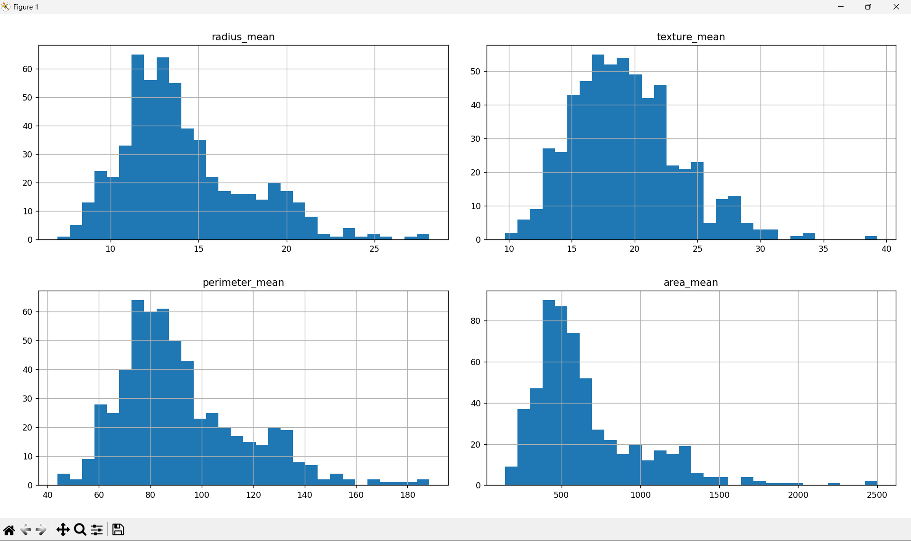
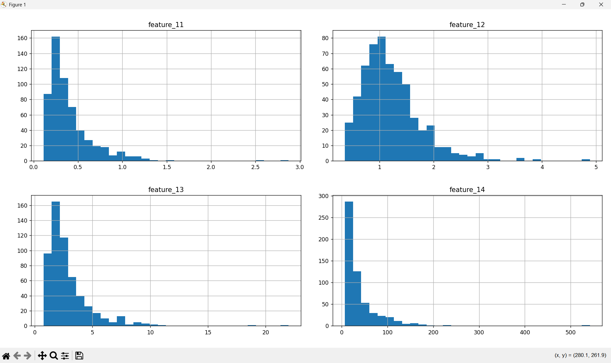
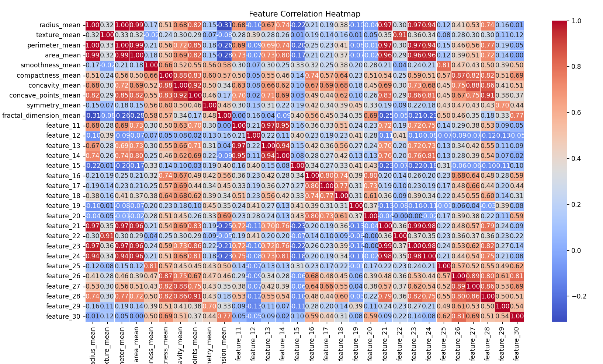

# Model Comparison Report: Logistic Regression vs Neural Network (MLP)

## 1. Dataset Overview
This project uses the **Breast Cancer Wisconsin (Diagnostic)** dataset, a binary classification task
with the goal of predicting whether a tumor is **benign** or **malignant** based on numerical features
computed from digitized images of breast tissue.

- Number of samples: 569
- Number of features: 30 (continuous)
- Target variable: Binary (0 = Benign, 1 = Malignant)

The dataset is relatively small, clean, and contains many highly correlated features.

---

## 2. Data Preprocessing

### 2.1 Train / Validation / Test Split
The dataset was split into three disjoint sets:
- **Training set**: used to learn model parameters
- **Validation set**: used for hyperparameter tuning and model comparison
- **Test set**: reserved for final evaluation only (not used during development)

This separation ensures a fair and unbiased evaluation.

### 2.2 Feature Scaling
All features were standardized using **z-score normalization**:

$$
x_{scaled} = \frac{x - \mu}{\sigma}
$$

Scaling was fit on the training set and applied consistently to validation and test sets.

---

## 3. Models Evaluated

### 3.1 Logistic Regression (Baseline)
A Logistic Regression model with **L2 regularization** was used as the baseline.

**Why Logistic Regression?**
- Well-suited for linearly separable problems
- Handles correlated features effectively with L2 regularization
- Low variance and strong generalization on small datasets

---

### 3.2 Neural Network (MLP from Scratch)
A fully connected neural network was implemented **from scratch using NumPy**, with the following architecture:

- Input layer: 30 features
- Hidden layer: 16 units, ReLU activation
- Output layer: 1 unit, Sigmoid activation
- Loss: Binary Cross-Entropy
- Optimization: Gradient Descent
- Regularization: L2 weight decay

This implementation included:
- He initialization
- Explicit forward and backward propagation
- Manual gradient computation
- L2 regularization in both loss and gradients

#### Model Architecture

The MLP model follows a classic forward propagation sequence:

1. **Hidden Layer 1:** 

$$
Z_1 = X \cdot W_1 + b_1
$$  
$$
A_1 = \text{ReLU}(Z_1)
$$

2. **Output Layer:** 
$$
Z_2 = A_1 \cdot W_2 + b_2
$$  
$$
\hat{y} = \text{Sigmoid}(Z_2)
$$

### Loss Function
We use **Binary Cross-Entropy** with L2 Regularization to train the model:

$$Loss = -\frac{1}{n} \sum_{i=1}^{n} [y \log(\hat{y}) + (1-y) \log(1-\hat{y})] + \lambda \sum ||W||^2$$

---

## 4. Evaluation Metrics
Models were evaluated on the **validation set** using:
- Accuracy
- Confusion Matrix
- Precision
- Recall
- F1-score (Malignant class)

These metrics are especially important due to the medical nature of the task, where false negatives
are particularly costly.

---

## 5. Results

### 5.1 Logistic Regression (Validation Set)

Confusion Matrix:
[[71 0]
[ 2 41]]

Key observations:
- Very low false positives
- Only 2 false negatives
- Strong balance between precision and recall
- Excellent generalization performance

---

### 5.2 Neural Network (MLP, Validation Set)

Confusion Matrix:
[[70 1]
[ 4 39]]

Key observations:
- Higher false negatives compared to Logistic Regression
- Slightly lower recall and F1-score
- More sensitive to hyperparameters and initialization

---

## 6. Discussion

Despite being a more expressive model, the Neural Network did **not outperform Logistic Regression**.
This result is expected given the properties of the dataset:

- The dataset is relatively small
- Many features are highly correlated
- The decision boundary is close to linear
- Logistic Regression has a strong inductive bias for this problem

Neural Networks have higher variance and typically require larger datasets or more complex nonlinear
patterns to outperform linear models.

This experiment demonstrates that **model complexity does not guarantee better performance**, and
that simpler models can be optimal when their assumptions align well with the data.

---

## 7. Key Takeaways

- Logistic Regression is a very strong baseline for structured, tabular data
- Proper evaluation using validation and test splits is crucial
- Neural Networks require careful tuning and sufficient data to shine
- Building an MLP from scratch deepened understanding of:
  - Backpropagation
  - Optimization
  - Regularization
  - Model evaluation discipline

---

## 8. Future Work
Possible extensions include:
- Applying PCA to reduce feature correlation before training the MLP
- Adding Batch Normalization to the Neural Network
- Using cross-validation for more stable evaluation
- Scaling to larger or more complex datasets where neural networks are more appropriate

---

## 9. Conclusion
For this dataset, **Logistic Regression outperformed a manually implemented Neural Network**.
This result reinforces the importance of choosing models based on data characteristics rather than
model complexity alone.
